# Hi, I'm Harjas Singh 👋

  

### 🚀 Quantitative Development & Applied Machine Learning
Electronics & VLSI Design student at DTU, passionate about algorithmic trading systems, statistical modeling, and computer vision architectures.

---

### 🛠️ Technical Toolkit
* **Languages:** Python, C++, SQL, LaTeX
* **Machine Learning & Quant:** TensorFlow Keras, Scikit-Learn, Pandas, NumPy, Statsmodels, VADER NLP
* **Data Pipelines & Visualization:** Plotly, BeautifulSoup, Matplotlib, Seaborn, yfinance
* **Developer Tools:** VSCode, Linux / Bash, Jupyter, Google Colab

---

### 📂 Featured Projects
* 📈 **[algorithmic-stock-rating-program](https://github.com/harjasjolly-create/algorithmic-stock-rating-program/tree/main)**: Multi-factor algorithmic trading model combining ML technical classifiers, fundamental valuation scoring, and NLP news sentiment.
* 👁️ **[cattle-classifier-v1](https://github.com/harjasjolly-create/cattle-classifier-v1/tree/main):** Deep learning vision pipeline utilizing MobileNetV2 for automated feature extraction and object detection, built for classifying Indian cattle breeds.

---

### 📬 Connect With Me
* **LinkedIn:** [harjas-singh-849303273](https://www.linkedin.com/in/harjas-singh-849303273)
* **Email:** [harjasjolly@gmail.com](mailto:harjasjolly@gmail.com)
